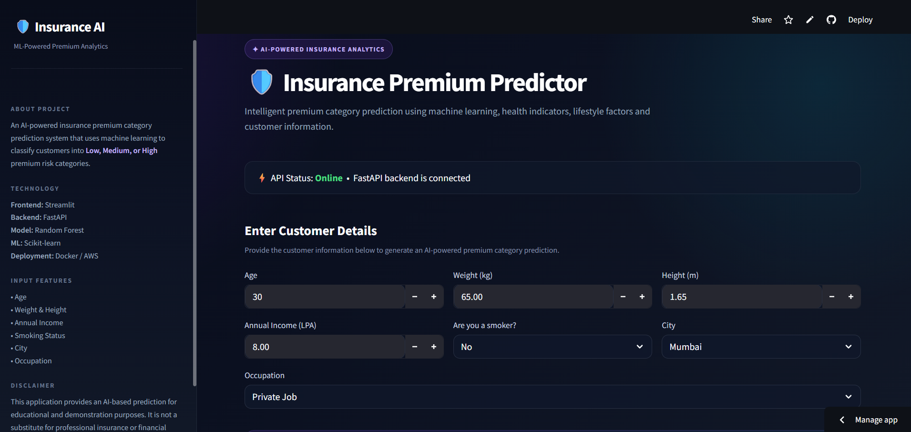
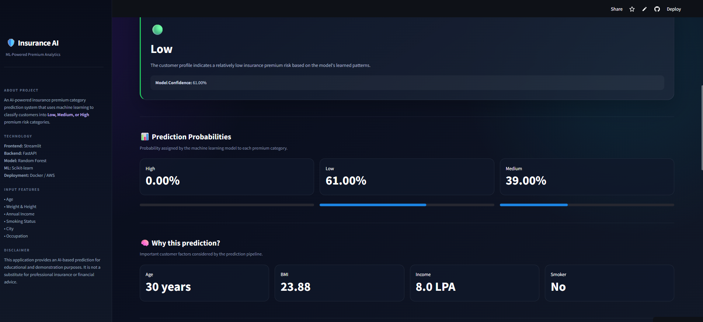
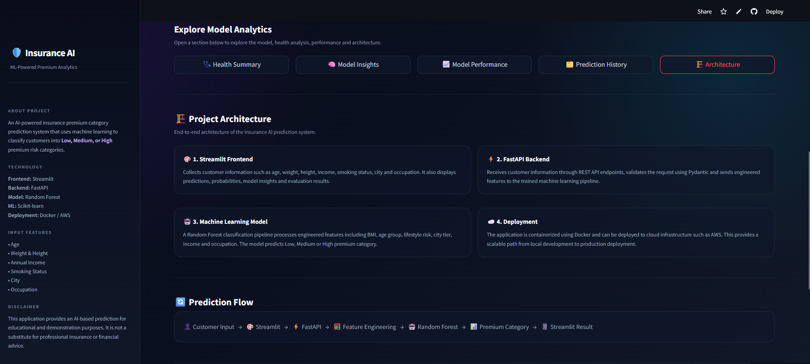
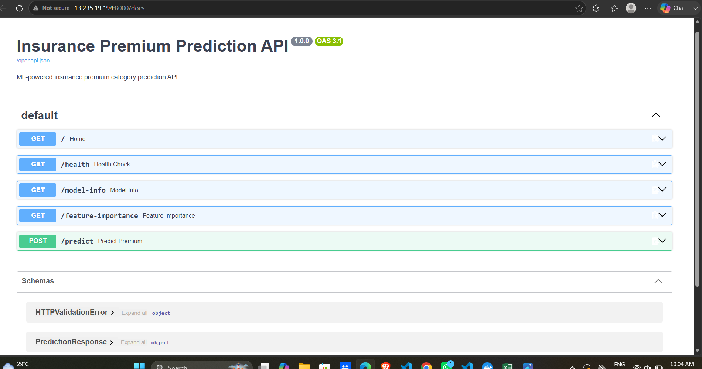

# 🏥 Insurance Premium Category Prediction

An end-to-end **Machine Learning application** that predicts an insurance premium category — **Low, Medium, or High** — based on demographic, lifestyle, and financial information.

The project combines a **Scikit-learn Machine Learning model**, **FastAPI REST API**, **Streamlit frontend**, and **Dockerized AWS deployment** to provide a complete production-style ML application.

## 🚀 Live Demo

### 🌐 Web Application

**Try the live application:**
https://insurance-premium-prediction-ctzu6phw7djgkwyvndcvbc.streamlit.app/

### ⚡ Backend API

The FastAPI backend is deployed on **AWS ECS using AWS Fargate**.

The frontend communicates with the deployed backend to generate predictions.

> **Note:** The backend uses a public ECS task IP and may change if the ECS task is replaced.

---

## ✨ Features

* 🔮 Predicts insurance premium category: **Low / Medium / High**
* 📊 Provides prediction confidence and class probabilities
* 🧮 Automatically calculates **BMI**
* 🧠 Machine Learning model using **Random Forest**
* ⚡ FastAPI REST API for model inference
* 🎨 Interactive Streamlit frontend
* ✅ Input validation using Pydantic
* 📈 Model feature importance
* 📋 Health summary based on user inputs
* 🏗️ Project architecture visualization
* 📊 Model evaluation metrics
* 🐳 Dockerized backend
* ☁️ AWS ECS Fargate deployment
* 🚀 Streamlit Cloud frontend deployment
* 🔗 GitHub-based source control

---

## 🧠 Machine Learning

The project uses a **Random Forest Classifier** inside a Scikit-learn Pipeline.

### Model Features

The model uses the following engineered features:

* `bmi`
* `age_group`
* `lifestyle_risk`
* `city_tier`
* `income_lpa`
* `occupation`

### Feature Engineering

#### BMI

BMI is calculated using:

```text
BMI = Weight (kg) / Height² (m)
```

#### Age Group

Users are categorized into:

* Young
* Adult
* Middle Aged
* Senior

#### Lifestyle Risk

Lifestyle risk is determined using:

* Smoking status
* BMI

Possible categories:

* Low
* Medium
* High

#### City Tier

Cities are classified into:

* Tier 1
* Tier 2
* Tier 3

---

## 📊 Model Evaluation

The model was evaluated using **5-fold stratified cross-validation** and a separate test dataset.

| Metric             |      Score |
| ------------------ | ---------: |
| Dataset Size       |        100 |
| Training Samples   |         80 |
| Testing Samples    |         20 |
| 5-Fold CV Accuracy |    **81%** |
| Test Accuracy      |    **75%** |
| Weighted Precision | **78.39%** |
| Weighted Recall    |    **75%** |
| Weighted F1 Score  | **75.63%** |

### Evaluation Methods

* Stratified 5-Fold Cross Validation
* Train/Test Split
* Accuracy
* Precision
* Recall
* F1 Score
* Confusion Matrix
* Classification Report

---

## 🏗️ System Architecture

```text
                    ┌─────────────────────────┐
                    │       User / Client     │
                    └────────────┬────────────┘
                                 │
                                 ▼
                    ┌─────────────────────────┐
                    │   Streamlit Frontend    │
                    │     Streamlit Cloud     │
                    └────────────┬────────────┘
                                 │
                         HTTP POST /predict
                                 │
                                 ▼
                    ┌─────────────────────────┐
                    │      FastAPI Backend    │
                    │       AWS ECS Fargate   │
                    └────────────┬────────────┘
                                 │
                                 ▼
                    ┌─────────────────────────┐
                    │  Feature Engineering    │
                    │ BMI / Risk / Age / Tier │
                    └────────────┬────────────┘
                                 │
                                 ▼
                    ┌─────────────────────────┐
                    │   Scikit-learn Pipeline │
                    │    Random Forest Model  │
                    └────────────┬────────────┘
                                 │
                                 ▼
                    ┌─────────────────────────┐
                    │ Prediction + Confidence │
                    │  Class Probabilities    │
                    └─────────────────────────┘
```

---

## 🛠️ Tech Stack

### Machine Learning

* Python
* Scikit-learn
* Pandas
* NumPy
* Joblib

### Backend

* FastAPI
* Uvicorn
* Pydantic

### Frontend

* Streamlit

### Deployment & DevOps

* Docker
* AWS ECS
* AWS Fargate
* Amazon ECR
* Streamlit Community Cloud
* Git
* GitHub

---

## 📂 Project Structure

```text
Insurance-Premium-Prediction/
│
├── Model/
│   ├── model.pkl
│   ├── model_evaluated.pkl
│   └── predict.py
│
├── config/
│   └── city_tier.py
│
├── schema/
│   ├── user_input.py
│   └── prediction_response.py
│
├── data/
│   └── insurance.csv
│
├── app.py
├── frontend.py
├── train_model.py
├── evaluate_model.py
├── model_evaluation.py
├── check_model.py
│
├── Dockerfile
├── .dockerignore
├── .gitignore
├── requirements.txt
├── runtime.txt
└── README.md
```

---

## ⚙️ Installation

### 1. Clone the Repository

```bash
git clone https://github.com/AKSHITOMAR/Insurance-Premium-Prediction.git
```

### 2. Navigate to the Project

```bash
cd Insurance-Premium-Prediction
```

### 3. Create a Virtual Environment

```bash
python -m venv myenv
```

Activate it on Windows:

```bash
myenv\Scripts\activate
```

### 4. Install Dependencies

```bash
pip install -r requirements.txt
```

---

## ▶️ Run FastAPI Locally

Start the backend:

```bash
uvicorn app:app --reload
```

The API will be available at:

```text
http://127.0.0.1:8000
```

### Swagger API Documentation

Open:

```text
http://127.0.0.1:8000/docs
```

Available endpoints include:

```text
GET  /
GET  /health
GET  /model-info
GET  /feature-importance
POST /predict
```

---

## ▶️ Run Streamlit Locally

Start the frontend:

```bash
streamlit run frontend.py
```

The application will normally open at:

```text
http://localhost:8501
```

> When running the frontend locally, make sure the FastAPI backend is also running or configure the frontend to use the deployed backend.

---

## 🐳 Run with Docker

### Build the Image

```bash
docker build -t insurance-premium-api .
```

### Run the Container

```bash
docker run --rm -p 8000:8000 insurance-premium-api
```

The API will then be available at:

```text
http://127.0.0.1:8000
```

Swagger:

```text
http://127.0.0.1:8000/docs
```

---

## 🌐 API Usage

### POST `/predict`

Example request:

```json
{
    "age": 30,
    "weight": 65,
    "height": 1.70,
    "income_lpa": 10,
    "smoker": false,
    "city": "Mumbai",
    "occupation": "private_job"
}
```

Example response:

```json
{
    "predicted_category": "Medium",
    "confidence": 0.54,
    "class_probabilities": {
        "High": 0.36,
        "Low": 0.10,
        "Medium": 0.54
    }
}
```

---

## ❤️ Health Check

### GET `/health`

The health endpoint verifies that the API and Machine Learning model are available.

Example response:

```json
{
    "status": "OK",
    "version": "1.0.0",
    "model_loaded": true
}
```

---

## 📊 Model Information

### GET `/model-info`

Returns information about the deployed Machine Learning model, including:

* Model type
* Model version
* Prediction classes
* Features
* Number of features
* Pipeline components
* Feature importance availability

### GET `/feature-importance`

Returns the feature importance values generated by the Random Forest model.

---

## 🔐 Input Validation

The FastAPI backend uses **Pydantic** to validate incoming data.

Examples of validation include:

* Age constraints
* Positive weight
* Valid height range
* Income validation
* Required input fields

This helps prevent invalid data from reaching the Machine Learning model.

---

## ☁️ Deployment

The project uses a split deployment architecture:

### Frontend

**Streamlit Community Cloud**

```text
GitHub Repository
       ↓
Streamlit Cloud
       ↓
Public Web Application
```

### Backend

**AWS ECS + Fargate**

```text
Docker Image
     ↓
Amazon ECR
     ↓
AWS ECS
     ↓
AWS Fargate
     ↓
FastAPI API
```

### Complete Flow

```text
User
 ↓
Streamlit Cloud
 ↓
FastAPI API
 ↓
Feature Engineering
 ↓
Random Forest Model
 ↓
Prediction
 ↓
Streamlit UI
```

---

## 📸 Screenshots

### 🏠 Streamlit Frontend



### 🎯 Prediction Result



### 📊 Feature Importance



### ⚡ FastAPI Swagger UI



---


## 🔮 Future Improvements

* 🔐 User authentication and authorization
* 🗄️ Database integration
* 📦 Model versioning
* 📈 Production model monitoring
* 🔄 Automated CI/CD using GitHub Actions
* 🔒 HTTPS and secure API access
* 🌐 Custom domain
* ⚖️ Load balancing using AWS Application Load Balancer
* 📊 Larger and more diverse training dataset
* 🧪 Automated testing
* ☁️ Cloud-based model storage
* 📉 Performance and latency monitoring

---

## 👩‍💻 Author

### Akshi Tomar

B.Tech CSE (AI & ML)

GitHub:
https://github.com/AKSHITOMAR

---

## ⭐ Support

If you found this project useful or interesting, consider giving the repository a ⭐ on GitHub!

---

## 📜 License

This project is intended for educational and portfolio purposes.
